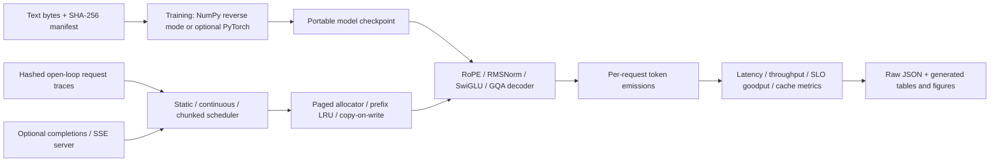

# Forge

**A transformer training and serving laboratory that measures useful throughput
under latency constraints on consumer hardware.**

Forge implements a decoder, an independent reverse-mode training engine,
contiguous and paged KV caches, prefix reuse, copy-on-write ownership, and three
serving policies. Its central experiment asks which policy produces the most
requests meeting a latency target at a fixed memory budget. Results include
queueing, rejected requests, raw arrival traces, and implementation hashes.

## Current evidence

This is a first measured release, not a finished production LLM engine. CUDA
training and the optional HTTP server are verified on an RTX 4050 Laptop GPU; the
MPS path is implemented but not verified.

- **A 14.26M-parameter byte-level decoder trained on WikiText-103 reaches 1.272
  nats/byte (1.836 bits/byte) on the full official validation split**, against 2.440
  for a byte bigram and 3.184 for a byte unigram fit on the same training bytes.
  Training: 30,000 updates, 61.44M bytes, 30.6 minutes in bf16 on the RTX 4050, peak
  CUDA allocation 627 MiB. [Results, loss curve, and fixed samples](docs/wikitext103_14m/RESULTS.md);
  [raw evaluation](results/wikitext103_14m/evaluation.json). Greedy decoding falls
  into repetition loops; sampled text is locally fluent but not coherent.
- 62 tests pass on the laptop's CUDA environment; 2 skip because MPS is unavailable.
  CUDA logits match the independent NumPy oracle for manual and SDPA attention,
  including through the paged KV cache.
- Cached logits match full-sequence logits across chunks, with explicit tolerances.
- Heterogeneous batched generation matches independent generation for all policies.
- Allocation stress tests check ownership after every transition. Cancellation,
  exhaustion, prefix eviction, and failed copy-on-write do not leak references.
- Finite differences check reverse-mode gradients, including a complete transformer.
- A save/restart test reproduces uninterrupted CPU training **bit for bit**.
- A 32,928-parameter model trained for 200 updates / 51,200 byte-token observations
  on a synthetic JSON grammar. Held-out diagnostic loss fell from 5.565 to 1.016
  nats/byte; the unigram baseline is 3.054. This validates training machinery, not
  natural-language capability. [Raw summary](results/cpu_training_summary.json).
- CPU serving results use a **randomly initialized 115,008-parameter model**.
  They measure implementation overhead and workload behavior, not language quality.
  [Cache paths](results/cpu_ladder_v1.json),
  [raw scheduling runs](results/cpu_head_of_line_v1/benchmark.json), and
  [generated results table](docs/cpu_head_of_line/RESULTS.md).

The CI workflow is checked in but has not run on a remote repository. It installs
CPU PyTorch and the serving dependencies so the optional modules run there too.
No GPU serving speedup or production p99 is claimed yet.

## Why this project

The interesting evidence is the relationship between capacity, latency, and memory.
An optimization can improve raw throughput while reducing the fraction of requests
that finish within the latency target. A tiny model can expose Python, padding, and
gather overhead that a large model hides. Forge publishes losing configurations
alongside winning ones and tests the cache transformations before measuring them.

## Architecture



The model uses tied byte embeddings, pre-normalization, causal attention and
grouped KV heads. All model/cache code is local. The CPU reference uses NumPy;
PyTorch provides tensor execution and AdamW on its optional backend. The optional
SDPA path is a **PyTorch built-in optimized baseline**, separately identified in
results. Forge does not implement a fused attention kernel or use a serving engine.

The pool preallocates fixed physical blocks. Admitted requests reserve enough
blocks for their maximum continuation, preventing a full pool from deadlocking
decoders. Admission is FIFO; chunked prefill prioritizes decode and rotates prompt
selection. Full prompt blocks can be shared, and shared writable blocks detach
before modification. Prefix cache entries consume pool memory and are evicted
under allocation pressure.

## Run it

Python 3.11+ and NumPy are enough for the CPU path:

```bash
python -m venv .venv
# Activate .venv using your shell's standard activation command.
python -m pip install -e '.[dev,plots]'
pytest
python -m forge prepare --synthetic --out data/diagnostic
python -m forge train --data data/diagnostic --out checkpoints/demo --steps 200 --dim 32 --batch 8
python -m forge generate --checkpoint checkpoints/demo/model.npz --prompt '{"id":' --tokens 32
python -m forge ladder --out results/my_ladder.json --repeats 10
python -m forge bench --out results/my_run --workload mixed --requests 128 --rates 10 30 --seeds 17 29 43
python -m forge report --input results/my_run/benchmark.json --out docs/my_run
python -m forge evaluate --run checkpoints/demo --data data/diagnostic --out results/demo_eval
```

Long jobs (training, sweeps, full evaluations) should be started with
`python scripts/detach.py --name <job> -- <command>` so they keep running when the
terminal, editor, or coding agent that started them exits; `--status` lists them.

`--text path/to/corpus.txt` prepares a local corpus instead of the synthetic
diagnostic. Byte-level losses are not comparable to published BPE perplexities.
Corpora/checkpoints are ignored by Git. Retain corpus license and source metadata
when preparing real training evidence. Choose a new output folder for a new
training schedule; `--resume` preserves the original schedule and dataset identity.

On this laptop a `.venv-cpu` environment was installed offline, sharing the
existing NumPy installation read-only. It runs `python -m forge` without setting
`PYTHONPATH`. The existing `eqdata` environment was used to execute pytest/ruff;
no `eqdata` source or dependencies were changed.

For GPU and server commands see the [laptop runbook](runs/LAPTOP.md). For the
16-core Xeon / 96 GiB Intel Mac see the [Mac runbook](runs/MAC.md). Its AMD GPU has
8 GB discrete VRAM; the system RAM is not a 96 GB GPU budget. The older MPS stack
is an optional compatibility experiment, not the primary training platform.

## Read and reproduce the results

[The experiment contract](docs/EXPERIMENTS.md) defines the metrics, controls,
workloads, and limits. Each scheduling output contains the environment, model
configuration, weight and source hashes, exact seeds, request traces, and
per-request outcomes. Policy ordering rotates across seeds. The benchmark is an
in-process open-loop experiment; HTTP/SSE timings are a separate measurement.

The cache microbenchmark compares full recomputation, contiguous KV, and paged
KV. A headline speedup against recomputation should not be attributed to paging.
Compare the two cached paths before claiming that paging accelerates a request.

## What remains for the portfolio release

Done: CUDA verification on the RTX 4050, and WikiText-103 training with full-split
evaluation, baselines, loss curve, and fixed samples (see Current evidence).

1. Run sustained CUDA traces with at least 1,000 requests per setting and repeat
   across load, chunk budgets, prefix reuse, and KV capacity. Publish full sweeps.
2. Add an HTTP open-loop load generator and compare its timings with the in-process
   trace harness. Record disconnect/cancellation and overload behavior.
3. Choose one advanced extension justified by profiling: a fused paged gather
   kernel, speculative sampling, or quantization. Each needs correctness checks and
   a workload where its benefits and costs can be measured.

These are pending milestones, not features listed as completed for a resume.
See the [interview walkthrough](docs/INTERVIEW.md) for the decisions already
supported by code and tests.
