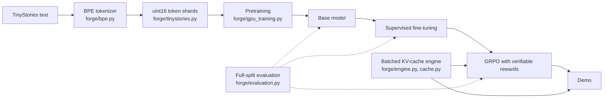

# Forge

**A small language model built from scratch, end to end, on a 6 GB laptop GPU:
own BPE tokenizer → pretraining → supervised fine-tuning → reinforcement learning
with verifiable rewards → demo.**

Every stage is implemented in this repository rather than imported: the tokenizer,
the transformer (with an independent NumPy autograd engine as a reference), the
training loop, evaluation, and a batched KV-cache inference engine. Each stage is
tested against a reference implementation and measured on full held-out splits.
Training data is [TinyStories](https://arxiv.org/abs/2305.07759), where models of a
few tens of millions of parameters can learn to write coherent stories.

| Stage | Status | Result so far |
|---|---|---|
| 1. Tokenizer | **Done** | Byte-level BPE; 4,096-token vocabulary compresses TinyStories as well as GPT-2's 50,257 |
| 2. Pretraining | **In progress** | 5.8M model writes coherent stories (0.552 bits/byte); ablations done; 16M and 34M training now |
| 3. Supervised fine-tuning | Planned | Follow story instructions (required words, a given sentence, dialogue) |
| 4. RL with verifiable rewards | Planned | GRPO with rule-checked rewards and a KL penalty |
| 5. Demo and write-up | Planned | |

The phases follow Andrej Karpathy's *Neural Networks: Zero to Hero* series;
phases 3 and 4 go beyond it. The full plan is in [PLAN.md](PLAN.md).

## Results

### Tokenizer

[`forge/bpe.py`](src/forge/bpe.py) implements byte-level BPE with the GPT-4
pre-split pattern. Loaded with OpenAI's published cl100k (GPT-4) merge table, its
encoder reproduces `tiktoken` token for token on the test texts (English,
contractions, numbers, emoji, accents, CJK, code, whitespace runs).
Training counts distinct pre-split chunks once and updates only the words each
merge touches (checked against a naive recount), so the full 2.2 GB corpus trains
in under three minutes on 10 CPU workers.

Bytes per token on the TinyStories validation split (higher is better), with our
tokenizers trained on the training split only:

| Tokenizer | Vocabulary | Bytes per token |
|---|---:|---:|
| Forge BPE | 2,048 | 3.735 |
| **Forge BPE** | **4,096** | **4.049** |
| GPT-2 | 50,257 | 4.057 |
| GPT-4 (cl100k) | 100,277 | 4.142 |
| Forge BPE | 8,192 | 4.179 |

A tokenizer fit to its domain matches GPT-2's compression with a vocabulary 12
times smaller. The model uses the 4,096 vocabulary: 542.9M training tokens.
[Raw comparison](results/tokenizer/compare.json).

### Pretraining (in progress)

Learning-rate sweep for the smallest model (5.8M parameters, 24.9M tokens each,
65,536 tokens per step), scored on the full validation split:

| Peak learning rate | Validation loss (nats/token) | Bits per byte |
|---:|---:|---:|
| 1e-3 | 2.3038 | 0.8251 |
| **2e-3** | **2.2495** | **0.8057** |
| 4e-3 | 2.8636 | 1.0256 |
| 8e-3 | 3.2675 | 1.1703 |

At 4e-3 training did not diverge; it stalled on an early plateau (validation 4.08 at
step 100 against 3.38 at 2e-3) and never recovered within the budget.
[Raw results](results/lr_sweep/).

**S model (5.8M parameters, 115.3M tokens): 1.5420 nats/token, 0.5523 bits per
byte** on the full validation split (token bigram baseline 3.595, unigram 5.936).
It already writes coherent stories; prompted with "Lily and Ben went to the park.":

> They saw a big pond with many ducks. There were many ducks and frogs. Lily and
> Ben liked the ducks. They wanted to feed them some bread.

([fixed samples and loss curve](docs/phase2/S/RESULTS.md))

Ablations on the S model (60.3M tokens each, validation loss in nats/token, seeds
17 and 29):

| Variant | Seed 17 | Seed 29 | Mean |
|---|---:|---:|---:|
| Baseline: float32 RoPE angles, 2 KV heads (GQA) | 1.7143 | 1.7304 | 1.7224 |
| bf16 RoPE angles (the original code) | 1.7323 | 1.7362 | 1.7342 |
| Full multi-head attention (4 KV heads) | 1.7114 | 1.7265 | 1.7189 |

- **RoPE angle precision.** Under bf16 autocast the original code computed rotary
  angles in bf16, perturbing some cosines by up to 1.56 at positions up to 511.
  It was worse with both seeds (+0.018 and +0.006), a small but consistent cost.
- **Grouped-query attention** with half the KV heads was within seed noise of full
  multi-head attention (0.0035 apart against a 0.016 seed-to-seed spread), while
  halving the KV cache.

Still training ([plan](runs/plans/phase2.json)): the M (15.7M) and L (33.6M)
models, for the scaling curve.

## How it is built



- **Model** ([`model.py`](src/forge/model.py), [`torch_backend.py`](src/forge/torch_backend.py)):
  decoder-only transformer with RoPE, RMSNorm, SwiGLU, grouped-query attention, and
  tied embeddings. The NumPy implementation runs on its own reverse-mode autograd
  ([`autograd.py`](src/forge/autograd.py), checked by finite differences) and is the
  oracle the PyTorch/CUDA path is tested against.
- **Training** ([`gpu_training.py`](src/forge/gpu_training.py)): AdamW, warmup and
  cosine decay, gradient accumulation (tested equal to one large batch), gradient
  clipping, bf16 autocast, and checkpoints every 100 steps holding weights,
  optimizer state, data-sampling RNG, and schedule, so an interrupted run resumes.
- **Evaluation** ([`evaluation.py`](src/forge/evaluation.py)): every token of the
  validation split scored once, bits per byte (comparable across tokenizers),
  n-gram baselines fit on the same training data, loss curves, fixed-seed samples.
- **Inference** ([`engine.py`](src/forge/engine.py), [`cache.py`](src/forge/cache.py)):
  paged KV cache with copy-on-write prefix sharing and continuous batching; it will
  generate the RL rollouts and serve the demo.

## Engineering findings

Measured along the way, each with the evidence in this repository:

- **No FlashAttention in the Windows PyTorch build.** There, `enable_gqa` silently
  falls back to the math kernel: 24.9 ms per layer forward+backward against 3.2 ms
  for causal SDPA with copied KV heads, so Forge copies the heads.
- **Host overhead dominated KV-cache decoding.** The paged cache rebuilt its indices
  in every layer with per-request host-to-device copies. Building them once per
  forward cut paged decode from 15.98 to 8.79 ms/token with identical output; at
  this model size decode is limited by kernel launches. [Before/after](results/engine_overhead/).
- **Windows throttles background jobs.** Detached processes without a window ran 8x
  slower (efficiency cores, low clocks) until the job launcher opted them out of
  power throttling.

## Earlier work

Before the move to TinyStories, the same code trained a 14.26M-parameter
byte-level model on WikiText-103: 1.272 nats/byte (1.836 bits/byte) on the full
validation split, against 2.440 for a byte bigram, in 30.6 minutes on the RTX 4050
([results](docs/wikitext103_14m/RESULTS.md)). It also served as a test bed for
batching policies: in a 1,000-request open-loop benchmark at 35 requests/s,
continuous batching kept 95.1% of requests within the latency target against 3.3%
for static batching ([results](docs/cuda_sweep_mixed/RESULTS.md),
[method](docs/EXPERIMENTS.md)).

## Reproduce

Python 3.11+, with PyTorch for GPU training (the laptop uses 2.8 with CUDA 12.8).
Commands assume the virtual environment is active.

```bash
python -m venv .venv
python -m pip install torch==2.8.0 --index-url https://download.pytorch.org/whl/cu128
python -m pip install -e ".[dev,plots]"
python -m pytest

# Tokenizer and corpus (TinyStoriesV2 files in data/raw/, revision pinned in PLAN.md)
python -m forge prepare-tinystories --train data/raw/TinyStoriesV2-GPT4-train.txt \
  --valid data/raw/TinyStoriesV2-GPT4-valid.txt --out data/tinystories --results results/tokenizer

# Training plans: each run is trained, then evaluated on the full validation split
python scripts/run_plan.py runs/plans/lr_sweep.json
python scripts/run_plan.py runs/plans/phase2.json
```

Long jobs go through `python scripts/detach.py --name <job> -- <command>`, which
keeps them running after the terminal or editor that started them closes
(`--status`, `--stop <job>`). A plan restarted with the same command skips
finished runs and resumes an interrupted one from its last checkpoint. Machine
specific notes: [laptop](runs/LAPTOP.md), [Mac](runs/MAC.md).

## Data and licenses

- TinyStories (Eldan and Li, 2023): CDLA-Sharing-1.0, Hugging Face
  `roneneldan/TinyStories` and `roneneldan/TinyStoriesInstruct` at pinned revisions.
- WikiText-103: CC BY-SA 3.0 and GFDL.

Datasets and checkpoints are not stored in Git. The trained WikiText-103 weights
are attached to the `wikitext103-14m` release.
