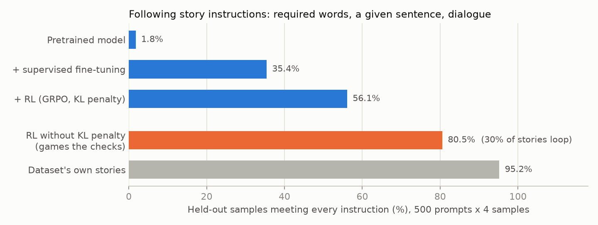
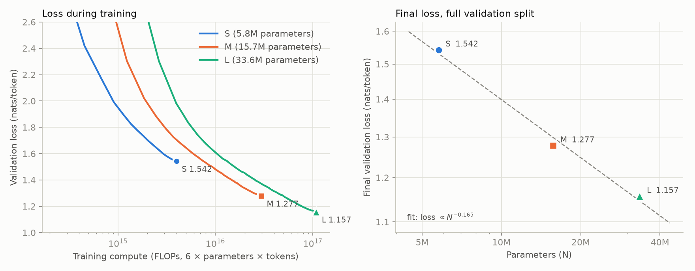
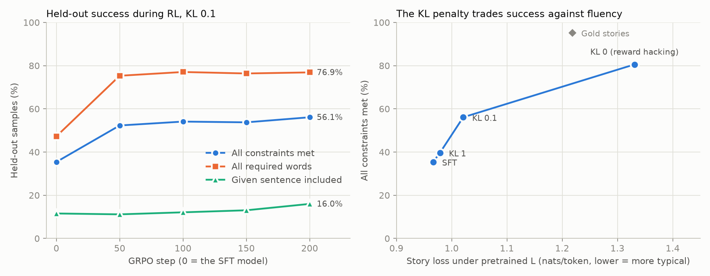
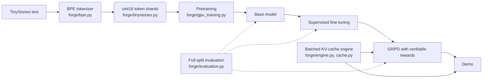

# Forge

**A 34M-parameter language model built from scratch on one 6 GB laptop GPU and
taken through the modern LLM pipeline: its own BPE tokenizer → pretraining →
supervised fine-tuning → reinforcement learning with verifiable rewards.**

<picture>
  <source media="(prefers-color-scheme: dark)" srcset="docs/headline-dark.png">
  
</picture>

- **Built, not imported.** The tokenizer (it reproduces OpenAI's `tiktoken` GPT-4
  encoding token for token on the test texts), the transformer (checked against an independent NumPy
  autograd implementation), the training loop, a paged-KV-cache inference engine with
  continuous batching, supervised fine-tuning, and GRPO are all implemented here.
- **Pretraining.** Three model sizes trained on
  [TinyStories](https://arxiv.org/abs/2305.07759); the 33.6M model reaches 0.414
  bits per byte on the full validation split and writes coherent stories. Scaling
  curve and architecture ablations included.
- **Instruction following, measured.** On 500 held-out prompts scored by rule-based
  checks (required words, a given sentence, dialogue), the share of stories meeting
  every instruction rises from 1.8% (pretrained) to 35.4% (SFT) to 56.1% (RL;
  55.9 ± 0.4% across three training seeds).
- **Reward hacking, found and quantified.** Without the KL penalty, RL reaches 80.5%
  by gaming the checks: it forces required words in ("he went to the park and *seat*
  on a dirty bench") and repeats the given sentence until a copy matches; 30% of its
  stories loop. The penalty keeps the policy honest at a small cost in fluency.
- **Debugged on real hardware.** The laptop hibernated from overheating mid-run (so
  training now pauses at 85 °C), Windows throttled background jobs 8x, and an
  evaluation silently dropped most of its requests until reading the outputs
  exposed it. Each is documented below with its fix.

| Stage | Result | Details |
|---|---|---|
| 1. Tokenizer | Byte-level BPE; a 4,096-token vocabulary compresses TinyStories as well as GPT-2's 50,257 | [below](#tokenizer) |
| 2. Pretraining | 33.6M model, 0.414 bits/byte; scaling curve over 3 sizes; RoPE and GQA ablations | [results](docs/phase2/RESULTS.md) |
| 3. Supervised fine-tuning | 35.4% of held-out samples meet every instruction, up from 1.8% | [results](docs/sft/RESULTS.md) |
| 4. RL with verifiable rewards | 56.1% with GRPO; a KL-penalty ablation exposes reward hacking | [results](docs/grpo/RESULTS.md) |
| 5. Demo | The three stages write a story for the same instruction side by side, scored live | [below](#demo) |

The phases follow Andrej Karpathy's *Neural Networks: Zero to Hero* series;
phases 3 and 4 go beyond it. The full plan is in [PLAN.md](PLAN.md).

## Results

### Tokenizer

[`forge/bpe.py`](src/forge/bpe.py) implements byte-level BPE with the GPT-4
pre-split pattern. Loaded with OpenAI's published cl100k (GPT-4) merge table, its
encoder reproduces `tiktoken` token for token on the test texts (English,
contractions, numbers, emoji, accents, CJK, code, whitespace runs).
Training counts distinct pre-split chunks once and updates only the words each
merge touches (checked against a naive recount), so the full 2.2 GB corpus trains
in under three minutes on 10 CPU workers.

Bytes per token on the TinyStories validation split (higher is better), with our
tokenizers trained on the training split only:

| Tokenizer | Vocabulary | Bytes per token |
|---|---:|---:|
| Forge BPE | 2,048 | 3.735 |
| **Forge BPE** | **4,096** | **4.049** |
| GPT-2 | 50,257 | 4.057 |
| GPT-4 (cl100k) | 100,277 | 4.142 |
| Forge BPE | 8,192 | 4.179 |

A tokenizer fit to its domain matches GPT-2's compression with a vocabulary 12
times smaller. The model uses the 4,096 vocabulary: 542.9M training tokens.
[Raw comparison](results/tokenizer/compare.json).

### Pretraining

Three model sizes trained from scratch, 65,536 tokens per step, each scored on all
5.48M tokens of the validation split ([full results](docs/phase2/RESULTS.md)):

<picture>
  <source media="(prefers-color-scheme: dark)" srcset="docs/phase2/scaling-dark.png">
  
</picture>

| Model | Parameters | Training tokens | Loss (nats/token) | Bits per byte |
|---|---:|---:|---:|---:|
| S | 5.8M | 115.3M | 1.5420 | 0.5523 |
| M | 15.7M | 315.2M | 1.2773 | 0.4575 |
| **L** | **33.6M** | **542.6M** | **1.1566** | **0.4142** |

The token bigram baseline is 3.595 nats/token. Loss falls roughly as N^-0.165 over
these three points. The curves show the compute frontier: at M's full budget, M was
ahead of L at equal compute, and L needed 1.7x as much compute to match it before
going past it. L writes coherent stories with dialogue and a plot (temperature 0.8,
not cherry-picked):

> One day, a girl named Mia found a magic wand. The wand had a big smile and it
> made Mia shrink! She was very surprised. Mia thought, "I need to use the wand to
> help others." Mia saw a boy named Tim who was sad. She walked up to him and
> asked, "Why are you sad?" Tim said, "I lost my toy car."

Learning-rate sweep for the smallest model (5.8M parameters, 24.9M tokens each),
scored on the full validation split:

| Peak learning rate | Validation loss (nats/token) | Bits per byte |
|---:|---:|---:|
| 1e-3 | 2.3038 | 0.8251 |
| **2e-3** | **2.2495** | **0.8057** |
| 4e-3 | 2.8636 | 1.0256 |
| 8e-3 | 3.2675 | 1.1703 |

At 4e-3 training did not diverge; it stalled on an early plateau (validation 4.08 at
step 100 against 3.38 at 2e-3) and never recovered within the budget.
[Raw results](results/lr_sweep/).

Ablations on the S model (60.3M tokens each, validation loss in nats/token, seeds
17 and 29):

| Variant | Seed 17 | Seed 29 | Mean |
|---|---:|---:|---:|
| Baseline: float32 RoPE angles, 2 KV heads (GQA) | 1.7143 | 1.7304 | 1.7224 |
| bf16 RoPE angles (the original code) | 1.7323 | 1.7362 | 1.7342 |
| Full multi-head attention (4 KV heads) | 1.7114 | 1.7265 | 1.7189 |

- **RoPE angle precision.** Under bf16 autocast the original code computed rotary
  angles in bf16, perturbing some cosines by up to 1.56 at positions up to 511.
  It was worse with both seeds (+0.018 and +0.006), a small but consistent cost.
- **Grouped-query attention** with half the KV heads was within seed noise of full
  multi-head attention (0.0035 apart against a 0.016 seed-to-seed spread), while
  halving the KV cache.

The laptop overheated during the first run (Windows hibernated it after a critical
thermal event), so training now pauses whenever the GPU reaches 85 °C
([`forge/thermal.py`](src/forge/thermal.py)); the 34M run paused 2,836 times.

### Supervised fine-tuning

L fine-tuned on 300,000 TinyStories-Instruct examples (an instruction, then the
story), with the loss on story tokens only: 1,400 steps, 75 minutes. Scored on 500
fixed held-out prompts, 4 samples each, by rule-based checks that later serve as the
RL reward ([full results](docs/sft/RESULTS.md)):

| | Base L | SFT L | Gold stories |
|---|---:|---:|---:|
| **All constraints met** | **1.8%** | **35.4%** | **95.2%** |
| Required words found (per word) | 17.9% | 77.7% | 99.0% |
| All required words found | 1.0% | 47.3% | 97.0% |
| Given sentence included | 0.1% | 11.6% | 100.0% |
| Dialogue when requested | 20.9% | 95.5% | 94.7% |
| Story ended | 99.7% | 93.8% | 100.0% |

SFT learned the format, dialogue, and most required words, but rarely copies the
given sentence verbatim. The first evaluation under-reported SFT at 5.1%: the
generation command queued 2,000 requests at once and the serving engine's admission
limits silently dropped most of them. Generation now runs without those limits and
fails loudly instead.

### Reinforcement learning with verifiable rewards

GRPO from the SFT model, with the same rule-based checks as the reward: 200 steps,
each sampling 8 stories for each of 16 training prompts through the batched
KV-cache engine, with group-relative advantages and a penalty on the KL divergence
from the SFT model (computed exactly over the 4,096-token vocabulary). About an hour
per run on the laptop ([full results](docs/grpo/RESULTS.md)):

<picture>
  <source media="(prefers-color-scheme: dark)" srcset="docs/grpo/grpo-dark.png">
  
</picture>

| Same 500 held-out prompts | SFT | KL 1 | **KL 0.1** | KL 0 |
|---|---:|---:|---:|---:|
| **All constraints met** | 35.4% | 39.6% | **56.1%** | 80.5% |
| All required words found | 47.3% | 54.1% | **76.9%** | 97.9% |
| Given sentence included | 11.6% | 10.3% | **16.0%** | 50.0% |
| Fluency: nats/token under the pretrained model | 0.966 | 0.979 | **1.021** | 1.331 |
| Stories looping (≥10% repeated 4-grams) | 1.6% | 1.5% | **2.1%** | 29.8% |

With the KL coefficient at 0.1, RL lifted full instruction satisfaction from 35.4%
to 56.1% (95% bootstrap interval over prompts 52.6-59.6%; three training seeds gave
55.9 ± 0.4%) while staying close to the SFT model in fluency and repetition. Without the penalty the reward climbed
higher by gaming the checks, which only test that a word or sentence appears:
required words forced in ("he went to the park and *seat* on a dirty bench"), and
the given sentence repeated until a copy matched ("The bird kept running. The bird
kept running after the bird. The bird kept running..."); 30% of its stories loop.
The given sentence stays the weak point of the honest policy.

### Demo

[`demo/app.py`](demo/app.py) is a web page where you give an instruction (required
words, a sentence, features, a summary) and the pretrained, fine-tuned, and RL-trained
models each write a story, streamed token by token through the KV-cache engine, with
every constraint checked as it was during RL. It runs on a CPU (three stories in about
15 seconds on the laptop):

```bash
python -m pip install -e ".[demo]"
python demo/app.py    # needs checkpoints/L, sft_L, and grpo_kl0.1
```

`scripts/publish_hf.py` packages it as a Hugging Face Space and the three checkpoints
as a model repository.

## How it is built



- **Model** ([`model.py`](src/forge/model.py), [`torch_backend.py`](src/forge/torch_backend.py)):
  decoder-only transformer with RoPE, RMSNorm, SwiGLU, grouped-query attention, and
  tied embeddings. The NumPy implementation runs on its own reverse-mode autograd
  ([`autograd.py`](src/forge/autograd.py), checked by finite differences) and is the
  oracle the PyTorch/CUDA path is tested against.
- **Training** ([`gpu_training.py`](src/forge/gpu_training.py)): AdamW, warmup and
  cosine decay, gradient accumulation (tested equal to one large batch), gradient
  clipping, bf16 autocast, and checkpoints every 100 steps holding weights,
  optimizer state, data-sampling RNG, and schedule, so an interrupted run resumes.
- **Evaluation** ([`evaluation.py`](src/forge/evaluation.py)): every token of the
  validation split scored once, bits per byte (comparable across tokenizers),
  n-gram baselines fit on the same training data, loss curves, fixed-seed samples.
- **Inference** ([`engine.py`](src/forge/engine.py), [`cache.py`](src/forge/cache.py)):
  paged KV cache with copy-on-write prefix sharing and continuous batching; it
  generates the RL rollouts and evaluation samples.
- **Instruction tuning** ([`instruct.py`](src/forge/instruct.py), [`sft.py`](src/forge/sft.py)):
  TinyStories-Instruct parsing, rule-based constraint checks (inflections allowed,
  validated on the dataset's own stories), loss-masked SFT data, and fluency scoring
  under another model.
- **RL** ([`grpo.py`](src/forge/grpo.py)): GRPO with group-relative advantages and an
  exact KL penalty, resumable. Tests check that the KL and its gradient vanish at the
  reference model and that an interrupted run resumes to the same weights.

## Engineering findings

Measured along the way, each with the evidence in this repository:

- **No FlashAttention in the Windows PyTorch build.** There, `enable_gqa` silently
  falls back to the math kernel: 24.9 ms per layer forward+backward against 3.2 ms
  for causal SDPA with copied KV heads, so Forge copies the heads.
- **Host overhead dominated KV-cache decoding.** The paged cache rebuilt its indices
  in every layer with per-request host-to-device copies. Building them once per
  forward cut paged decode from 15.98 to 8.79 ms/token with identical output; at
  this model size decode is limited by kernel launches. [Before/after](results/engine_overhead/).
- **Windows throttles background jobs.** Detached processes without a window ran 8x
  slower (efficiency cores, low clocks) until the job launcher opted them out of
  power throttling.

## Earlier work

Before the move to TinyStories, the same code trained a 14.26M-parameter
byte-level model on WikiText-103: 1.272 nats/byte (1.836 bits/byte) on the full
validation split, against 2.440 for a byte bigram, in 30.6 minutes on the RTX 4050
([results](docs/wikitext103_14m/RESULTS.md)). It also served as a test bed for
batching policies: in 1,000-request open-loop benchmarks at 30 requests/s,
continuous batching kept 98.9-100% of requests within the latency target on each of
three seeds, against 1.4-18.7% for static batching. At 35 requests/s the median
seed still favored continuous batching (95.1% against 3.3%), but one seed fell to
25.9%, so that rate is past where the comparison is stable
([results](docs/cuda_sweep_mixed/RESULTS.md), [method](docs/EXPERIMENTS.md)).

## Reproduce

Python 3.11+, with PyTorch for GPU training (the laptop uses 2.8 with CUDA 12.8).
Commands assume the virtual environment is active.

```bash
python -m venv .venv
python -m pip install torch==2.8.0 --index-url https://download.pytorch.org/whl/cu128
python -m pip install -e ".[dev,plots]"
python -m pytest

# Tokenizer and corpus (TinyStoriesV2 files in data/raw/, revision pinned in PLAN.md)
python -m forge prepare-tinystories --train data/raw/TinyStoriesV2-GPT4-train.txt \
  --valid data/raw/TinyStoriesV2-GPT4-valid.txt --out data/tinystories --results results/tokenizer

# Training plans: each run is trained, then evaluated on the full validation split
python scripts/run_plan.py runs/plans/lr_sweep.json
python scripts/run_plan.py runs/plans/phase2.json

# Instruction data (TinyStoriesInstruct files in data/raw/) and SFT from the L model
python -m forge prepare-instruct --train data/raw/TinyStories-Instruct-train.txt \
  --valid data/raw/TinyStories-Instruct-valid.txt --out data/instruct --results results/instruct
python -m forge prepare-sft --instruct data/instruct \
  --tokenizer data/tinystories/tokenizer_4096.json --out data/sft
python -m forge train --backend torch --device cuda --attention sdpa --precision bf16 \
  --data data/sft --out checkpoints/sft_L --init checkpoints/L/model.npz --steps 1400 \
  --context 512 --batch 16 --accumulate 8 --lr 0.0003 --warmup 50 --min-lr-ratio 0.1 \
  --eval-batches 20 --eval-batch 16 --seed 17
# Evaluate a model on the held-out prompts (likewise for checkpoints/L, the base model)
python -m forge generate-instruct --backend torch --device cuda --attention sdpa \
  --checkpoint checkpoints/sft_L/model.npz --tokenizer data/tinystories/tokenizer_4096.json \
  --prompts data/instruct/eval_prompts.jsonl --samples 4 --out results/sft/sft_L_samples.jsonl
python -m forge instruct-eval --samples results/sft/sft_L_samples.jsonl \
  --prompts data/instruct/eval_prompts.jsonl --out results/sft/sft_L_eval.json

# GRPO runs and their evaluation; then the result pages
python scripts/run_grpo_plan.py runs/plans/phase4.json
python scripts/phase3_report.py && python scripts/phase4_report.py
```

Long jobs go through `python scripts/detach.py --name <job> -- <command>`, which
keeps them running after the terminal or editor that started them closes
(`--status`, `--stop <job>`). A plan restarted with the same command skips
finished runs and resumes an interrupted one from its last checkpoint. Notes for
the laptop: [runs/LAPTOP.md](runs/LAPTOP.md).

## Data and licenses

- TinyStories (Eldan and Li, 2023): CDLA-Sharing-1.0, Hugging Face
  `roneneldan/TinyStories` and `roneneldan/TinyStoriesInstruct` at pinned revisions.
- WikiText-103: CC BY-SA 3.0 and GFDL.

Datasets and checkpoints are not stored in Git. Trained weights are attached to
releases: the pretrained 33.6M TinyStories model to `tinystories-L-33m`, the
WikiText-103 model to `wikitext103-14m`.
