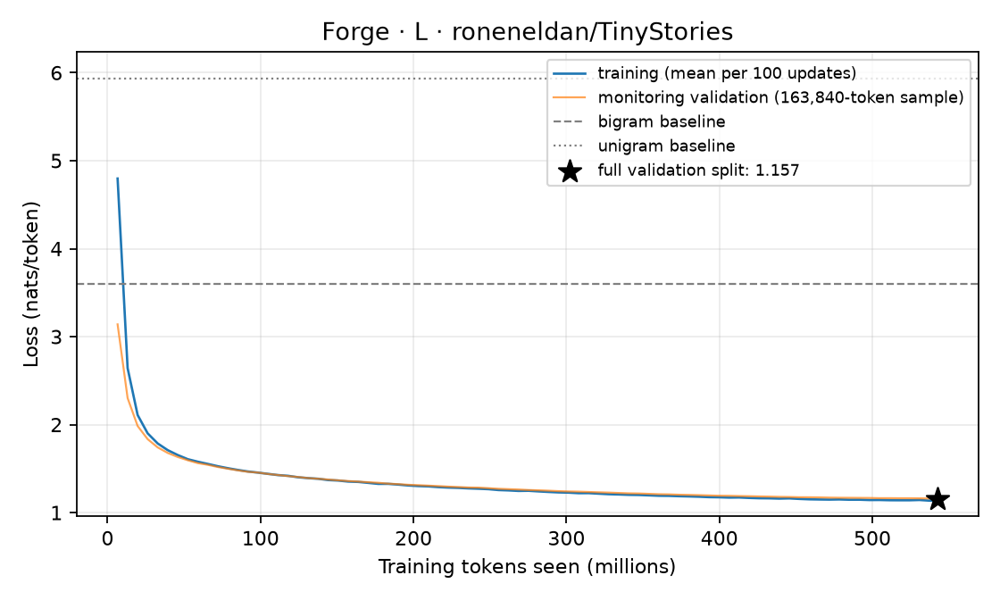

# L: held-out evaluation

A 33,565,184-parameter 4,096-token BPE decoder (10 layers, width 512, 8 heads / 4 KV heads) trained for 8,280 updates on 542.64M tokens of roneneldan/TinyStories in 402.1 minutes (bf16 training, peak CUDA allocation 3455 MiB).

## Held-out loss

Scored on all 5,480,734 predicted tokens of the validation split (split: official TinyStoriesV2-GPT4 train/valid files; non-overlapping 512-token windows; each token predicted once from 1 to 512 preceding tokens; fp32).

| Model | nats/token | bits/byte |
|---|---:|---:|
| **Forge 33.6M** | **1.1566** | **0.4142** |
| Token bigram, add-one, fit on the same training tokens | 3.5948 | 1.2875 |
| Token unigram, add-one, fit on the same training tokens | 5.9363 | 2.1261 |
| Uniform over 4,096 tokens | 8.3178 | 2.9790 |

The training loop's monitoring loss at the last update was 1.1610 nats/token, measured on a fixed sample of 163,840 tokens; the full-split number above is the one to cite. Per-token losses depend on the tokenizer; bits per byte compare across tokenizers on the same text.

## Training curve



Data: [`training_curve.jsonl`](../../../results/phase2/L/training_curve.jsonl) (mean training loss per 100 updates). Full results: [`evaluation.json`](../../../results/phase2/L/evaluation.json).

## Fixed samples

Up to 200 tokens per prompt through Forge's serving engine (`chunked` policy, stopping at end-of-text): greedy, then temperature 0.8 with top-p 0.95 (seed 17). Not cherry-picked: these prompts and settings are fixed in `forge/evaluation.py`.

**Prompt:** `Once upon a time`

Greedy:

```text
Once upon a time, there was a little girl named Lily. She loved to play with her toys and have fun. One day, she found a big box in her room. Lily was very excited and wanted to see what was inside.
Lily opened the box and found a small, harmless bug. The bug was green and had six legs. Lily thought the bug was cute and wanted to play with it. She picked up the bug and gave it a little squeeze. The bug was scared and ran away.
Lily felt sad that the bug was scared. She wanted to find it and make it feel safe. So, she put the bug back in the box and closed it. Lily learned that sometimes, things that seem scary are not so bad after all.
```

Sampled:

```text
Once upon a time, there was a little boy named Tim. He loved to play with his toy cars. One day, Tim saw a big red ambulance drive by his house. He thought the ambulance was very cool. Tim wanted to show the ambulance to his friends.
Tim went to his friends and said, "Look at the big red ambulance!" His friends were scared and said, "Tim, that is not a police car!" Tim felt bad, but he did not know that. He only knew that the ambulance was there to help people.
The next day, Tim and his friends played with their toy cars. They made them go fast and slow. But then, something unexpected happened. The ambulance with the helpers came to Tim's house. They were not mad, but they were surprised to see Tim with the ambulance. Tim's friends were confused and asked, "What happened to your ambulance?" Tim said, "The helpers did not know." His friends laughed and said, "That is not a
```

**Prompt:** `Lily and Ben went to the park.`

Greedy:

```text
Lily and Ben went to the park. They saw a big slide. They wanted to go on the slide. But there was a problem. The slide was too high for them. They could not reach the top.
They saw a man with a ladder. He was tall and strong. He was fixing the slide. He was fixing it. He was fixing it.
Lily and Ben had an idea. They asked the man if they could use his ladder. The man said yes. He gave them the ladder. He told them to hold the ladder and slide down.
Lily and Ben were happy. They thanked the man. They climbed the ladder. They slid down the slide. They laughed and clapped. They had fun.
They went on the slide again and again. They liked the slide. They liked the man. They liked each other. They were friends.
```

Sampled:

```text
Lily and Ben went to the park. They saw a big hill. They wanted to roll down the hill. They ran to the top and sat on the grass. They pushed their legs and whined. They pushed with their feet and giggled.
But the hill was too steep. They could not move. They tried to call for help, but no one heard them. They were scared and sad. They cried and hugged each other.
A nice lady saw them. She came to help them. She said, "What are you doing here? Why are you crying? Why are you crying?"
Lily and Ben told her what happened. They said, "We wanted to roll down the hill, but we could not. It was too hard. We were stuck."
The nice lady said, "I know you were trying to roll down the hill, but you have to be careful. The hill is not a hill. It is a hill. You can roll down it, but not on the hill. You have to ask the park
```

**Prompt:** `The little dog was sad because`

Greedy:

```text
The little dog was sad because he could not find his toy. He looked everywhere, but it was not there. The little dog did not know what to do. He was very sad and did not know what to do.
Then, the little dog saw a big tree. He thought maybe his toy was in the tree. He tried to climb the tree, but he was too small. The little dog did not give up. He tried again and again. Finally, he found his toy under a bush. The little dog was so happy! He played with his toy all day long.
```

Sampled:

```text
The little dog was sad because he wanted to play. The boy saw the dog was sad and wanted to help. The boy had an idea. He said, "Let's play a game. I will hide and you will try to find me."
The boy hid behind a big tree. The dog looked and looked, but he could not find the boy. Then, he saw the red ball. The dog ran to the ball and started to play with it. The boy came out from behind the tree and said, "I found you, dog!"
The dog was happy and said, "Thank you for playing with me!" The boy and the dog played together all day. They became good friends and had lots of fun. The boy's mom was happy to see them playing together. The boy learned that it is important to have fun and make new friends.
```

**Prompt:** `One day, a girl named Mia found a`

Greedy:

```text
One day, a girl named Mia found a big, red ball. She loved to play with it. Mia would throw the ball and then run to catch it. She was very happy when she played with her ball.
One day, Mia saw a boy named Tim. Tim was sad because he did not have a ball to play with. Mia wanted to help Tim. She thought about her big, red ball and had an idea. Mia decided to share her ball with Tim.
Mia and Tim played with the ball together. They had so much fun! They laughed and ran around the park. Mia was happy that she could share her ball with her new friend. From that day on, Mia and Tim played together every day, and they were the best of friends.
```

Sampled:

```text
One day, a girl named Mia found a magic wand. The wand had a big smile and it made Mia shrink! She was very surprised. Mia thought, "I need to use the wand to help others."
Mia saw a boy named Tim who was sad. She walked up to him and asked, "Why are you sad?" Tim said, "I lost my toy car." Mia looked at her wand and said, "I can help you find it!"
Mia waved her wand, and Tim's toy car appeared! Tim was so happy and said, "Thank you, Mia!" They became good friends and played together every day. And from that day on, Mia and Tim always used the magic wand to help others.
```
