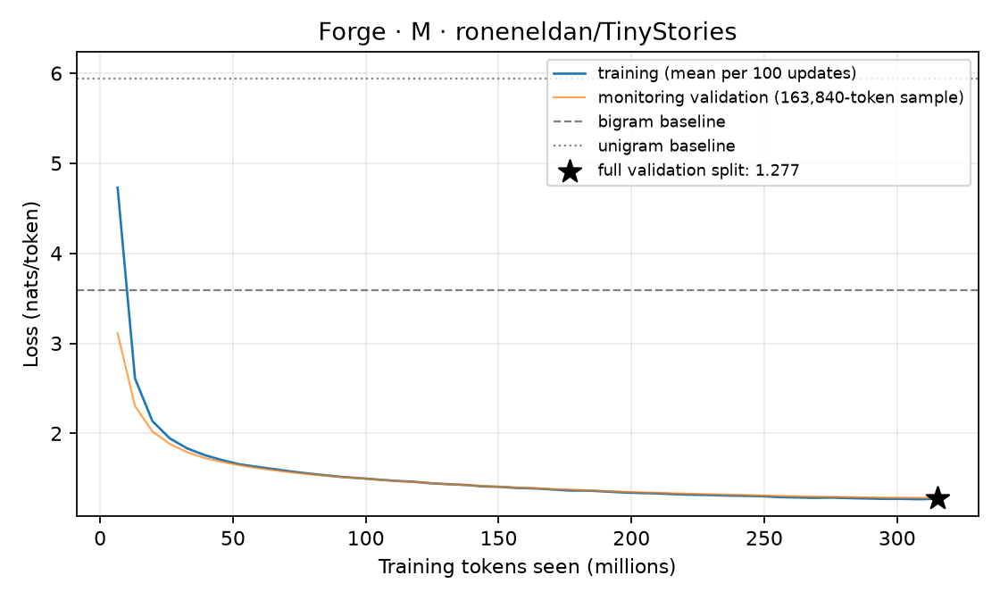

# M: held-out evaluation

A 15,735,168-parameter 4,096-token BPE decoder (8 layers, width 384, 6 heads / 3 KV heads) trained for 4,810 updates on 315.23M tokens of roneneldan/TinyStories in 98.3 minutes (bf16 training, peak CUDA allocation 2055 MiB).

## Held-out loss

Scored on all 5,480,734 predicted tokens of the validation split (split: official TinyStoriesV2-GPT4 train/valid files; non-overlapping 512-token windows; each token predicted once from 1 to 512 preceding tokens; fp32).

| Model | nats/token | bits/byte |
|---|---:|---:|
| **Forge 15.7M** | **1.2773** | **0.4575** |
| Token bigram, add-one, fit on the same training tokens | 3.5948 | 1.2875 |
| Token unigram, add-one, fit on the same training tokens | 5.9363 | 2.1261 |
| Uniform over 4,096 tokens | 8.3178 | 2.9790 |

The training loop's monitoring loss at the last update was 1.2827 nats/token, measured on a fixed sample of 163,840 tokens; the full-split number above is the one to cite. Per-token losses depend on the tokenizer; bits per byte compare across tokenizers on the same text.

## Training curve



Data: [`training_curve.jsonl`](../../../results/phase2/M/training_curve.jsonl) (mean training loss per 100 updates). Full results: [`evaluation.json`](../../../results/phase2/M/evaluation.json).

## Fixed samples

Up to 200 tokens per prompt through Forge's serving engine (`chunked` policy, stopping at end-of-text): greedy, then temperature 0.8 with top-p 0.95 (seed 17). Not cherry-picked: these prompts and settings are fixed in `forge/evaluation.py`.

**Prompt:** `Once upon a time`

Greedy:

```text
Once upon a time, there was a little girl named Lily. She loved to play with her toys and have fun with her friends. One day, Lily found a big, shiny rock in her yard. She was very happy and wanted to show it to her friends.
Lily ran to her friend Tom and said, "Look at my big, shiny rock! Let's play with it!" Tom looked at the rock and said, "No, Lily, that rock is too big for us. We should not play with it." But Lily did not listen to Tom. She wanted to show the rock to her friends.
Lily took the rock to her friends, and they all looked at it. They thought it was very special. They played with the rock all day and had lots of fun. Lily learned that it is important to listen to her friends and not to play with things that are not hers.
```

Sampled:

```text
Once upon a time, there was a little fish named Fin. Fin loved to swim in the big blue sea. One day, he saw a shiny medal hanging on a hook. He wanted the medal very much.
Fin swam up to the hook and said, "Hello, shiny medal! Can I have the medal?" The hook said, "No, Fin, I am not nice. I want to be left alone."
Fin was sad and swam back to his friends. He told them, "Please let me have the medal. I will be nice and share."
His friends said, "Okay, Fin. We will share the medal."
Fin was happy and shared the medal with his friends. They all played together and had a fun day. From that day on, they always shared and took turns.
```

**Prompt:** `Lily and Ben went to the park.`

Greedy:

```text
Lily and Ben went to the park. They saw a big slide and a swing. They wanted to play on them. They ran to the slide and climbed up the ladder. They sat on the slide and pushed themselves down. They felt the wind in their hair and the sun on their faces. They laughed and shouted.
But then, they heard a loud noise. It was a big dog. It was barking and running towards them. It wanted to play with them. Lily and Ben were scared. They did not know what to do. They held on to the slide and hoped the dog would not see them.
But the dog did not see them. It was a friendly dog. It came closer and wagged its tail. It wanted to play with them. It jumped on the slide and pushed it. The slide went very fast. Lily and Ben screamed. They were safe. They hugged each other and said sorry.
The dog's owner came and saw what happened. He was not happy. He said the dog was not a toy.
```

Sampled:

```text
Lily and Ben went to the park. They saw a big pond with ducks and fish. They wanted to feed them some bread. They saw some big bread on a bench. They took some bread and walked to the pond.
They threw some bread to the ducks and watched them eat. The ducks came to the pond and ate the bread. Lily and Ben laughed and clapped. They had fun at the park. They played with the ducks and the fish. They were happy.
```

**Prompt:** `The little dog was sad because`

Greedy:

```text
The little dog was sad because he lost his toy. He looked everywhere for it, but he could not find it. He was very sad.
Then, the little dog saw a big tree. He thought his toy might be there. He ran to the tree and found his toy. But, the toy was not there! The little dog was sad again. He looked and looked, but he could not find his toy.
Then, the little dog saw a little girl. She had the toy! The little dog was so happy. He ran to the girl and gave her the toy. The girl was happy too. She said, "Thank you, little dog!" The little dog was happy too. He did not need the toy to be happy.
```

Sampled:

```text
The little dog was sad because he wanted to play. The other animals saw the sad dog and wanted to help him. They all came together and played a fun game.
The animals started to unite and play together. They learned that even if someone is different, they can still be a good friend. The moral of the story is that when we unite and work together, we can make new friends and be happy.
```

**Prompt:** `One day, a girl named Mia found a`

Greedy:

```text
One day, a girl named Mia found a big box. She wanted to see what was inside. Mia tried to open the box, but it was hard. She asked her friend Tom for help. Tom said, "Let's try together!"
Mia and Tom tried to open the box. They pushed and pulled, but the box did not open. They were sad. Then, they saw a big, strong man. The man said, "I can help you open the box." Mia and Tom were happy. They let the man help them. The man opened the box, and inside was a big, soft bed for Mia and Tom to sleep on. They were very happy and thanked the man.
```

Sampled:

```text
One day, a girl named Mia found a pretty bracelet on the ground. It was shiny and had many colors. Mia was very happy. She wanted to show it to her friends.
Mia went to her friend Tom's house. She showed him the bracelet. Tom was excited too. They decided to write a note to the bracelet. They wrote a nice note and put it on Mia's wrist. Now, Mia and Tom were both happy.
They showed the bracelet to their friends. They all liked the pretty bracelet. They played together and had lots of fun. Mia and Tom were very happy to share the bracelet. They learned that sharing can make everyone happy.
```
