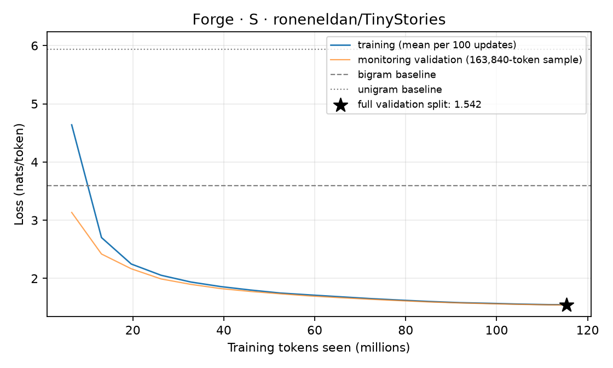

# S: held-out evaluation

A 5,770,496-parameter 4,096-token BPE decoder (6 layers, width 256, 4 heads / 2 KV heads) trained for 1,760 updates on 115.34M tokens of roneneldan/TinyStories in 238.0 minutes (bf16 training, peak CUDA allocation 1165 MiB).

## Held-out loss

Scored on all 5,480,734 predicted tokens of the validation split (split: official TinyStoriesV2-GPT4 train/valid files; non-overlapping 512-token windows; each token predicted once from 1 to 512 preceding tokens; fp32).

| Model | nats/token | bits/byte |
|---|---:|---:|
| **Forge 5.8M** | **1.5420** | **0.5523** |
| Token bigram, add-one, fit on the same training tokens | 3.5948 | 1.2875 |
| Token unigram, add-one, fit on the same training tokens | 5.9363 | 2.1261 |
| Uniform over 4,096 tokens | 8.3178 | 2.9790 |

The training loop's monitoring loss at the last update was 1.5440 nats/token, measured on a fixed sample of 163,840 tokens; the full-split number above is the one to cite. Per-token losses depend on the tokenizer; bits per byte compare across tokenizers on the same text.

## Training curve



Data: [`training_curve.jsonl`](../../../results/phase2/S/training_curve.jsonl) (mean training loss per 100 updates). Full results: [`evaluation.json`](../../../results/phase2/S/evaluation.json).

## Fixed samples

Up to 200 tokens per prompt through Forge's serving engine (`chunked` policy, stopping at end-of-text): greedy, then temperature 0.8 with top-p 0.95 (seed 17). Not cherry-picked: these prompts and settings are fixed in `forge/evaluation.py`.

**Prompt:** `Once upon a time`

Greedy:

```text
Once upon a time, there was a little boy named Tim. Tim loved to play with his toy cars. One day, he found a big, red car in his toy box. He was very happy and wanted to play with it.
Tim's mom saw him playing with the car and said, "Tim, you can play with the car if you want." Tim was very excited and said, "Yes, Mom!" He played with the car all day long. He made it go fast and slow, and he laughed and had lots of fun.
But then, Tim's mom came into the room and saw the car. She said, "Tim, you need to clean your room first. It's time to clean up." Tim didn't want to clean his room, so he said, "Okay, Mom. I will clean my room." So, Tim and his mom cleaned his room and put away the car. Tim was happy and promised to play with his car again soon.
```

Sampled:

```text
Once upon a time, there was a little boy named Tim. Tim had a toy car that he loved to play with every day. He would push it around the house and make it go very fast. One day, Tim's mom told him to be careful with his toy car. She said it was not safe to play with.
Tim went outside to play with his car. He saw a big tree and decided to lean on it. Tim wanted to see what was on the tree, so he leaned on the tree. As he leaned, he felt dizzy, and he fell down. His mom saw him and helped him up.
Tim's mom told him that it was okay to be careless, so he should not play with his toy car. Tim learned that it is important to listen to his mom and do what she tells him to do. From that day on, Tim always listened to his mom and played gently when he was older.
```

**Prompt:** `Lily and Ben went to the park.`

Greedy:

```text
Lily and Ben went to the park. They saw a big slide. They wanted to go on it. Lily said, "Let's go on the slide. It looks fun."
Ben said, "No, I want to go first. It's too high. I can't go on the slide."
Lily said, "No, I want to go on the slide. It is fun."
Ben said, "No, I want to go on the slide. It is fun. You can go on the slide."
Lily said, "No, I want to go on the slide. It is fun."
Ben said, "No, I want to go on the slide. It is fun. You can go on the slide."
Lily said, "No, I want to go on the slide. It is fun."
Ben said, "No, I want to go on the slide. It is fun. You can go on the slide."
Lily said, "No, I want to go on the slide. It is fun."

```

Sampled:

```text
Lily and Ben went to the park. They saw a big pond with many ducks. There were many ducks and frogs. Lily and Ben liked the ducks. They wanted to feed them some bread.
Lily and Ben were very happy. They put their bread and balls on the grass. They ran to the pond. They threw a ball to the ducks. They ran to the ducks. They threw their balls to them. The ducks came back. They quacked and quacked.
Lily and Ben were very happy. They thanked the ducks. They played with the ducks all day. They threw the ball back and forth. They had fun. They forgot about the ducks. They made new friends.
```

**Prompt:** `The little dog was sad because`

Greedy:

```text
The little dog was sad because he wanted to play with the ball. He thought of a plan to get the ball. He would throw the ball high in the air and catch it. The ball went up, up, up, and then it hit the ball. The ball went up, up, up, and then came down to the ground.
The little dog was so happy to play with the ball. He played with the ball all day long. The little dog was not sad anymore. He had a new friend, and they played together every day. And they lived happily ever after.
```

Sampled:

```text
The little dog was sad because he had no friends. The other animals saw this and told the dog that he didn't need a friend to play with. The dog learned that it is better to be kind and share with others.
The moral of the story is to always be kind and share with others, and friends can make you happy.
```

**Prompt:** `One day, a girl named Mia found a`

Greedy:

```text
One day, a girl named Mia found a big box. She opened the box and saw a lot of toys inside. Mia was very happy. She played with the toys all day long. She made a big mess in her room.
Mia's mom came into the room. She saw the mess and said, "Mia, you need to clean up your toys. It's important to clean up." Mia nodded and cleaned her room. She put all her toys away and put them away. Now, Mia could play with her toys again.
```

Sampled:

```text
One day, a girl named Mia found a magic wand. The wand could make things shrink. Mia thought it was a fun toy, so she took it to her friend Tom's house.
Mia said, "Look what I found! I can shrink things with this wand!" Tom was scared but did not give up. They played with the magic wand all day. They turned and turned the wand into a big, strong bear.
But then, something unexpected happened. The bear came to life! The bear was not a real bear. It was a big, friendly bear! The bear said, "Thank you for being kind and helping me. I will be your friend." Mia, Tom, and the bear all became friends and played together every day.
```
