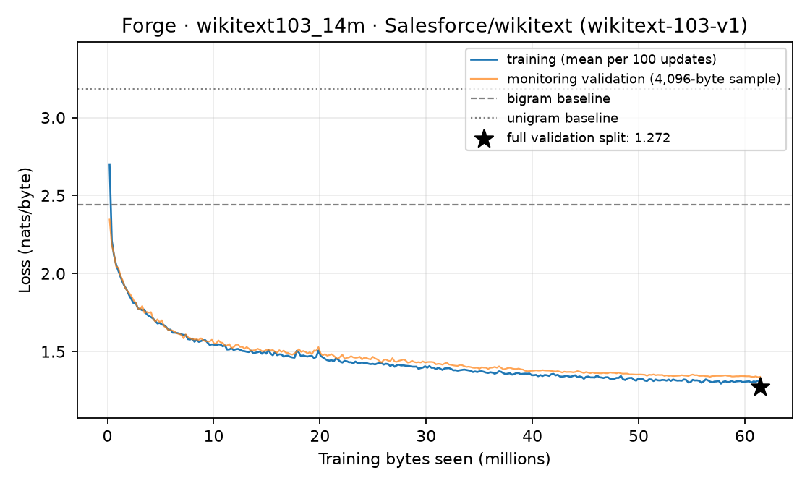

# wikitext103_14m: held-out evaluation

A 14,260,608-parameter byte-level decoder (8 layers, width 384, 4 heads / 2 KV heads) trained for 30,000 updates on 61.44M bytes of Salesforce/wikitext (wikitext-103-v1) in 30.6 minutes (bf16 training, peak CUDA allocation 627 MiB).

## Held-out loss

Scored on all 1,142,171 predicted bytes of the validation split (split: official train/validation; nonempty rows joined with newline; non-overlapping 256-token windows; each token predicted once from 1 to 256 preceding tokens; fp32).

| Model | nats/byte | bits/byte |
|---|---:|---:|
| **Forge 14.3M** | **1.2724** | **1.8358** |
| Byte bigram, add-one, fit on the same training bytes | 2.4399 | 3.5200 |
| Byte unigram, add-one, fit on the same training bytes | 3.1837 | 4.5931 |
| Uniform over 256 bytes | 5.5452 | 8.0000 |

The training loop's monitoring loss at the last update was 1.3381 nats/byte, measured on a fixed sample of 4,096 bytes; the full-split number above is the one to cite. Byte-level losses are not comparable to published BPE or word-level perplexities.

## Training curve



Data: [`training_curve.jsonl`](../../results/wikitext103_14m/training_curve.jsonl) (mean training loss per 100 updates). Full results: [`evaluation.json`](../../results/wikitext103_14m/evaluation.json).

## Fixed samples

Up to 200 bytes per prompt through Forge's serving engine (`chunked` policy): greedy, then temperature 0.8 with top-p 0.95 (seed 17). Not cherry-picked: these prompts and settings are fixed in `forge/evaluation.py`.

**Prompt:** `= History of the railway = ⏎ The railway`

Greedy:

```text
 = History of the railway = 
 The railway was a series of the second season , and the second season , and the second season , and the state of the season . The state of the second season , and the second season , and the second season , and 
```

Sampled:

```text
 = History of the railway = 
 The railway has to see plantation and the description of Finch and in a hardlet for damage was performed . The choice of California to the pitch was born in the second and dividence . The community counter of th
```

**Prompt:** `The album was released in`

Greedy:

```text
The album was released in the second season . The state of the second season , and the state of the season , and the state of the season , and the state of the season , and the state of the season , and the state of the seaso
```

Sampled:

```text
The album was released in the Taskson leader the president senset of the earlier said of diapers between Trica Common , becoming in the reason of the Man and the Great . It was a series of the popularity directed the game of 
```

**Prompt:** `In the early 19th century , the town`

Greedy:

```text
In the early 19th century , the town of the season , and the state of the season , and the second season , and the state of the season . The state of the second season , and the second season , and the second season , and the second sea
```

Sampled:

```text
In the early 19th century , the town and armies around 14 @,@ 000 feet ( 34 mm ) tons ) . 

 = = = Castle expanded in 1986 = = 

 The main is a primarily populated on the France , and were discovered the league railways and other winnin
```

**Prompt:** `The species is found in`

Greedy:

```text
The species is found in the second season , and the state of the season , and the second season , and the state of the season . The state of the second series , and the state of the season , and the state of the season , an
```

Sampled:

```text
The species is found in the end of the Atlantic , which was discovered the sequence , restricted the parliament , back at the federal regions . He also complete is subside for store and changed over a period diversion of th
```
